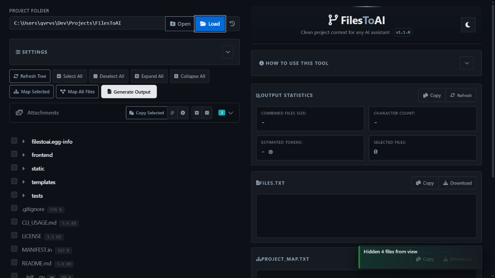

# FilesToAI

Export a codebase into clean, copy-ready context for ChatGPT, Claude, and other AI assistants.



---

## 🚀 Quick Start

### Install

```bash
python -m pip install --upgrade filestoai
```

### Command line

```bash
filestoai .                      # Export current directory
filestoai /path/to/project -gi   # With gitignore
filestoai . --size 200           # Custom size limit (200 KB)
```

### Web interface

```bash
filestoai --server
```

Then open `http://127.0.0.1:5023`.

---

## 💡 What It Does

**CLI:** Run `filestoai .` in any directory to copy an AI-ready export to the clipboard.

**Web:** Browse a project, select the useful files, keep media and documents separate, and generate or download the result.

---

## ✨ Features

### CLI Mode
- ⚡ **Lightning Fast** — Run `filestoai .` and get instant output
- 🎯 **Flexible Flags** — `-gi` for gitignore, `--size` for limits, `-i` for custom patterns
- 📋 **Auto Copy** — Output goes straight to clipboard
- 📁 **File Output** — Save to file with `-o filename.txt`
- 🔍 **Preview Mode** — `--list-files` to see what will be exported

### Web Interface
- ✓ `.gitignore` + custom patterns (with live testing)
- ✓ Nested `.gitignore` support
- ✓ Quick-select by extension
- ✓ Hide unwanted files (images, logs, minified)
- ✓ Separate attachment browser for media, PDFs, audio, and video
- ✓ File size limits + real-time stats
- 🔥 **Global Hotkey** — `Ctrl+Shift+Space` copies from anywhere
- 🌓 **Dark/Light Mode** — Automatically themed
- 📜 **Path History** — Recent projects saved
- 💾 **Persistent Config** — Settings survive restarts

### Both Modes
- **files.txt** — File contents concatenated
- **project_map.txt** — Directory structure
- **Smart Filtering** — Respect gitignore, size limits, custom patterns

## 📖 How To Use

### CLI Mode
```bash
# Basic usage
filestoai .                              # Export current directory
filestoai /path/to/project              # Export specific directory

# With options
filestoai . -gi                         # Respect .gitignore
filestoai . --size 200                  # Max file size limit (200 KB)
filestoai . -i "*.log,node_modules/"    # Custom ignore patterns
filestoai . -o output.txt               # Save to file
filestoai . --list-files                # Preview files

# Combined
filestoai . -gi --size 150 -i "dist/,*.min.js" -v

# Start web interface
filestoai --server               # Default port 5023
filestoai --server --port 8000   # Custom port
```

See [CLI_USAGE.md](CLI_USAGE.md) for all CLI options and examples.

### Web Interface

**Start the server:**
```bash
filestoai --server   # Via CLI (recommended)
# OR
python app.py        # Direct method
```

| Step | Action |
|------|--------|
| **1** | Choose or paste a project folder → Click **Load** |
| **2** | Configure filters & ignore patterns |
| **3** | Check files/folders in tree view |
| **4** | Click **Generate Output** or press `Ctrl+Shift+Space` |
| **5** | Copy or download results |

**Pro Tip:** Keep the app running in the background and use `Ctrl+Shift+Space` to instantly copy your last selection from any window.

---

## 🔧 Advanced

<details>
<summary><b>CLI Options</b></summary>

```bash
-gi, --gitignore              # Respect .gitignore files
-s, --size KB                 # Max file size in KB (default: 100)
-i, --ignore PATTERNS         # Custom ignore patterns (comma-separated)
-o, --output FILE             # Save to file instead of clipboard
--no-copy                     # Don't copy to clipboard
--include-binary              # Include binary files as placeholders
--project-map-only            # Only generate project structure
--files-only                  # Only generate file contents
--list-files                  # List files without generating output
-v, --verbose                 # Enable verbose logging
```

Full CLI documentation: [CLI_USAGE.md](CLI_USAGE.md)

</details>

<details>
<summary><b>Custom Ignore Patterns</b></summary>

Use `.gitignore` syntax for fine control:
```
node_modules/
*.log
__pycache__/
dist/**/*.map
```

**CLI**: `filestoai . -i "node_modules/,*.log"`
**Web**: Test patterns in-app before applying
</details>

<details>
<summary><b>API Endpoints</b></summary>

RESTful API for automation:
- `GET /api/browse` — Directory structure
- `POST /api/select` — File selection
- `POST /api/generate` — Generate output
- `POST /api/global_trigger_generate_and_copy` — Hotkey endpoint

See `app.py` for full docs.
</details>

<details>
<summary><b>Global Hotkey (Web Only)</b></summary>

Press anywhere with app running:
1. Reads the saved FilesToAI settings from your user data directory
2. Generates output from last selected files
3. Falls back to all files if none selected
4. Copies to clipboard instantly
</details>

---

## Development

```bash
git clone https://github.com/mystxcal/FilesToAI
cd FilesToAI
python -m pip install -e .
python -m pytest
```

Runtime settings and hotkey logs are stored under `%LOCALAPPDATA%\FilesToAI` on Windows, not inside the installed package.

---

## 🛠️ Tech Stack

`Flask` • `Bootstrap` • `jQuery` • `Python 3.8+`

---

## 📦 Dependencies

```
Flask>=2.3.0
keyboard>=0.13.5
pyperclip>=1.8.2
requests>=2.31.0
```

---

## 📄 License

MIT License

---

## 🤝 Contributing

PRs welcome! Open an issue for major changes.

---

<div align="center">

**Made for developers who ship with AI** ⚡

[⭐ Star this repo](https://github.com/mystxcal/FilesToAI) • [🐛 Report Bug](https://github.com/mystxcal/FilesToAI/issues) • [💡 Request Feature](https://github.com/mystxcal/FilesToAI/issues)

</div>
