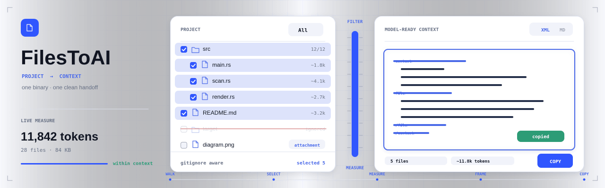
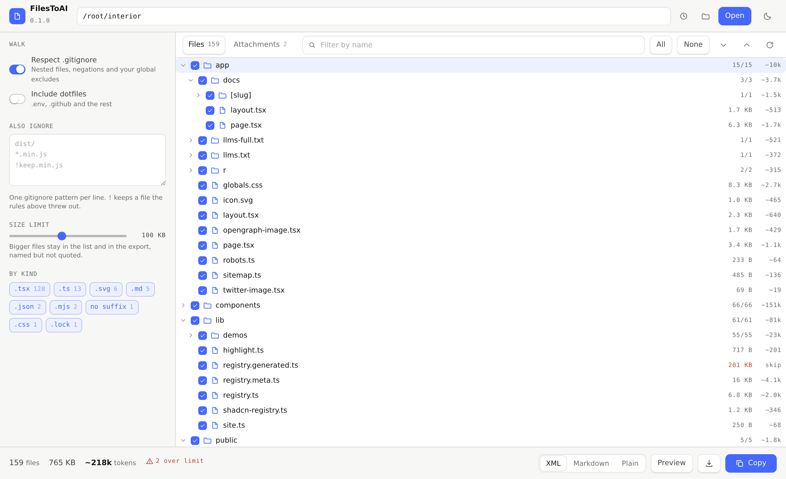

<picture>
  <source media="(prefers-color-scheme: dark)" srcset="docs/assets/banner-dark.gif">
  
</picture>

# FilesToAI

Turn a project on disk into one block of text you can paste into a language
model — with the directory tree, the files you picked, and an honest count of
what it will cost you in tokens.

It is a single Rust binary. The interface is compiled into it. There is no
Python, no Node runtime, no browser engine, and nothing to run alongside it.

```console
$ filestoai .
157 files · 765 KB · ~218k tokens → clipboard
  named but not quoted: 2 over the size limit, 2 not text
```

That is the whole tool from the terminal. If you would rather see what you are
sending before you send it, the same binary serves a local interface with a
token counter that moves as you tick files.

<picture>
  <source media="(prefers-color-scheme: dark)" srcset="docs/interface-dark.png">
  
</picture>

## Why it exists

Pasting a codebase into a chat window is a genuinely awkward problem. Cat the
whole directory and you send `node_modules`, a 4 MB lockfile and a PNG rendered
as mojibake. Pick files by hand and you spend five minutes on clerical work and
still forget the one file that mattered. Either way you find out what it cost
only after you have sent it and the context window says no.

So the three things this optimises for are: send the right files, know the size
before you commit to it, and do it in one command.

## Installing

```console
cargo install --git https://github.com/mystxcal/filestoai --locked filestoai
```

That is the only step. The interface ships inside the binary, so there is no
build stage, no `npm install`, and no separate server to keep running.

No prebuilt binaries yet — `cargo install` needs a Rust toolchain
([rustup.rs](https://rustup.rs)). Linux, macOS and Windows are all built and
tested in CI.

## Using it from the command line

```console
filestoai [PATH]
```

Where the output goes depends on who is asking. A terminal gets the clipboard
and a one-line summary on stderr. A pipe or a redirect gets the export itself
on stdout. You do not have to tell it which:

```console
filestoai .                      # → clipboard, summary on stderr
filestoai . > context.xml        # → the file
filestoai src/ | wc -c           # → the pipe
filestoai . --list | xargs wc -l # → line counts for what would be sent
```

That last one works because `--list` prints a readable table when a person is
looking at it and bare paths when a program is. Closing the pipe early
(`| head`) exits quietly rather than reporting a broken pipe.

| Flag | |
|---|---|
| `-i, --ignore <PATTERN>` | Extra ignore pattern in gitignore syntax. Repeatable. |
| `--no-gitignore` | Do not read `.gitignore` files. |
| `--hidden` | Include dotfiles and dot-directories. |
| `-s, --max-size <SIZE>` | Per-file limit; a bare number means kilobytes. `0` removes it. Default `100k`. |
| `-f, --format <FORMAT>` | `xml`, `markdown` or `plain`. Default `xml`. |
| `-o, --output <FILE>` | Write to a file. |
| `--map-only` | The directory tree with no file contents. |
| `--no-map` | File contents with no directory tree. |
| `-l, --list` | List what would be exported and stop. |
| `--serve` | Open the interface instead. `--port` to move it. |
| `--no-browser` | Start the interface without opening a browser. |

### A few workflows that come up

Send a model just the shape of a project before asking it where to start:

```console
filestoai . --map-only
```

Send one subsystem rather than the repository:

```console
filestoai src/parser -f markdown
```

Cut the noise a `.gitignore` does not cover, without editing the `.gitignore`:

```console
filestoai . -i "*.snap" -i "vendor/" -i "*.json" -i "!package.json"
```

Find out what it would cost without sending anything:

```console
$ filestoai . -o /dev/null
44 files · 303 KB · ~89k tokens → /dev/null
```

The summary always goes to stderr, so it survives having stdout redirected
somewhere you do not care about.

## Using the interface

```console
filestoai --serve
```

It opens on the folder you started it in, because that is the folder you meant.
Everything after that happens in the tab: ticking files, changing the size
limit, switching format.

The server keeps no session. Your selection lives in the browser, so two tabs
cannot disagree with each other and reloading loses nothing.

**The token count moves as you tick.** It is computed the same way the export
computes it — including the tags around each file and each file's line in the
directory map — so the number under the tree is the number the export reports,
not a smaller number that ignores the packaging.

**Files too big to quote stay visible.** They are marked `skip` in the tree and
appear in the output as a named omission, so the model can still see that the
file exists and how large it is, and you are not left wondering where it went.

**Things that are not text get their own tab.** Images, PDFs, audio, video,
archives and fonts are listed under *Attachments*, with thumbnails for images
and buttons to open a file or reveal it in your file manager. Ticking one puts
its name and size in the export, never its bytes.

## What gets included, and what doesn't

Ignore rules go through [`ignore`](https://docs.rs/ignore), the crate ripgrep
uses, so `.gitignore` behaves exactly as it does in `git status`: nested
ignore files apply from their own directory down, `!` un-ignores, `dir/` means
the directory, and your global excludes and `.git/info/exclude` are read too.
Whatever you type into **Also ignore**, or pass to `-i`, is the same syntax.
Version-control directories are never walked, whatever the settings say.

This includes git's least-loved rule, which is worth knowing before it puzzles
you: **you cannot re-include a file whose parent directory is excluded.**
`vendor/` followed by `!vendor/keep.rs` keeps nothing, because the walk never
descends into an excluded directory to find out. Exclude the files instead —
`vendor/*` then `!vendor/keep.rs` — or narrow the first pattern. FilesToAI
behaves the same way `git status` does here, deliberately, down to this case.

Whether a file counts as text is decided from its name when the name is enough
— the extension, or `Dockerfile`, `Makefile`, `go.sum` and their kind — and
from a NUL byte in the first 8 KiB when it is not. An extensionless script is
read from its shebang. SVG is treated as text, because it is. Text is decoded
as UTF-8, lossily, rather than guessed at through a series of legacy code
pages.

## Output formats

`xml` is the default, for two reasons: a tag is an unambiguous boundary even
when a file's own contents look like prose, and a path kept in an attribute
stays attached to its file when a model rewrites the code inside it. Real
output, from a three-file project:

```xml
<context root="sample" files="3">
<map>
sample/
├── app/
│   └── page.tsx
├── logo.png
└── package.json
</map>
<file path="app/page.tsx" lang="tsx">
export default function Page() {
  return <main>hello</main>;
}
</file>
<file path="logo.png" omitted="image file, 7 B" />
<file path="package.json" lang="json">
{ "name": "sample" }
</file>
</context>
```

File contents are not escaped, deliberately — escaping would make the code
harder for both of you to read. The tags are a frame, not a strict document.

`markdown` puts each file under a heading in a fenced block, and grows the
fence past any backticks the file already contains, so a README full of code
samples does not break the document it lands in. `plain` is ruled separators
and nothing else.

## How accurate is the token count?

`characters / 4` is the usual estimate, and on source code it is wrong in the
direction that matters. Code is punctuation-dense and indentation-heavy, so it
tokenises harder than the prose that ratio came from. Embedding a real
tokeniser would mean carrying about a megabyte of merge tables to answer a
question nobody needs to the digit.

So FilesToAI counts the six things a byte-pair encoder actually spends tokens
on — identifiers, the characters of an identifier past the third, runs of
punctuation, newlines, non-ASCII characters, and horizontal whitespace — and
weights them. The weights are a non-negative least-squares fit against
`cl100k_base` over 654 files and 11M characters of Rust, Python, TSX, CSS, HTML
and Markdown. Measured over that corpus:

| Estimator | Mean error | p90 |
|---|---:|---:|
| `characters / 4` | 11.2% | 22.2% |
| FilesToAI | **5.6%** | **10.9%** |

Every weight is interpretable, which is the check that it fit the tokeniser
rather than the corpus: an identifier costs about one token, a run of
punctuation slightly more, a newline a little over half, anything outside ASCII
about three-quarters, and indentation is nearly free until it piles up. On the
full exports spot-checked against `tiktoken` afterwards it ran about 3% high.

Two honest caveats. It is an estimate, not a count — if you need an exact
number, use a tool that embeds a real tokeniser. And it was fitted against
`cl100k_base`, so expect it to drift further on tokenisers that differ more
from that one.

The estimator exists twice, in Rust for the export and in TypeScript for the
live counter. `scripts/conformance.mjs` feeds both the same fixtures and fails
the build if any answer differs.

## How fast is it?

On a 6-core VM with a warm page cache:

| Input | Files walked | Output | Time |
|---|---:|---:|---:|
| This repository | 46 | 307 KB | 0.01 s |
| A Cargo registry checkout | 30,272 | 250 MB | 4.1 s |

Those times include reading every text file and counting its tokens, which is
what the walk actually does — the per-file token counts have to be ready before
you tick anything, so the interface can answer instantly afterwards. The
directory walk and the file reads are both parallel.

The binary is 3.4 MB.

## Is the local server safe to run?

`--serve` binds to loopback only, and for a process that can read every file
you can, that is not sufficient on its own. Any web page you happen to have
open can issue a request to `127.0.0.1`.

So the API also requires a per-run secret in a custom header, which a
cross-origin page cannot set without a preflight this server never approves,
and it rejects any request carrying an `Origin` that is not local. The secret
arrives in the URL fragment — which browsers do not send to servers — and the
interface moves it into `sessionStorage` on load.

File paths are resolved and confined to the project you opened. `../`, an
absolute path, and a symlink pointing out of the project all fail the same
check.

It is a single-user local tool. Do not put it behind a reverse proxy.

## What it does not do

- **Local directories only.** No GitHub URLs, no remote repositories. Clone it
  first.
- **No text extraction from binaries.** PDFs, images and archives are named and
  sized, never converted. There is no OCR.
- **Token counts are estimates**, as described above.
- Files over 4 MiB skip exact token counting and fall back to a rough figure,
  on the grounds that counting them precisely costs more than the answer is
  worth.
- The whole export is assembled in memory. A 250 MB export wants 250 MB.
- Image thumbnails in the attachments tab are skipped above 2 MB.
- On Linux, revealing a file in a file manager needs one that answers the
  freedesktop D-Bus call; otherwise it opens the containing folder instead.
- Also on Linux, the clipboard is handed to a small detached process that stays
  alive holding it, because X11 and Wayland selections die with the process
  that offered them. That is how `xclip` works too.

## How it compares

There are several good tools in this space and they make different trades.

| | Language / runtime | Local interface | Install |
|---|---|---|---|
| **FilesToAI** | Rust, single binary | Yes, built in | `cargo install` |
| [repomix](https://github.com/yamadashy/repomix) | TypeScript | No | Node / npm |
| [code2prompt](https://github.com/mufeedvh/code2prompt) | Rust | No | `cargo install` |
| [gitingest](https://github.com/coderamp-labs/gitingest) | Python | Hosted web app | Python / pip |
| [files-to-prompt](https://github.com/simonw/files-to-prompt) | Python | No | pip |

Reasons to pick something else, plainly: repomix has a much larger feature
surface, including Tree-sitter-based compression, and you are probably already
running Node. gitingest turns a public GitHub URL into an extract without
cloning anything, which this cannot do at all. files-to-prompt is smaller and
simpler than any of them and pipes beautifully. code2prompt is the closest
neighbour — a Rust CLI with templating — and if you want prompt templates it
has them and this does not.

What FilesToAI is actually for: you want one binary with nothing behind it, you
want to see and adjust the selection before you send it, and you want the token
figure in front of you while you choose rather than after.

## Building from source

```console
cd ui && npm ci && npm run build   # compiles the interface into crates/server/dist
cargo build --release
```

`crates/server/dist` is committed, which is what lets `cargo install filestoai`
work with no Node toolchain anywhere in sight. Rebuild it whenever `ui/`
changes; CI fails if the committed build and a fresh one differ.

The gates:

```console
cargo fmt --all -- --check
cargo clippy --workspace --all-targets -- -D warnings
cargo test --workspace
node --experimental-strip-types scripts/conformance.mjs
cd ui && npm run check
```

The layout is three crates and an interface. `crates/core` walks, classifies
and renders, and knows nothing about either front end. `crates/cli` is the
command line. `crates/server` is the local API and the embedded interface.
`ui/` is the React source that compiles into it.

## The version before this one

FilesToAI began as a Flask and jQuery application, and this is a full rewrite.
The idea was right; the implementation was not. The file selection lived in a
server-side session, the tree was rendered twice — once as HTML on the server
and once as JSON on the client — and gitignore patterns were translated into
regular expressions by hand. Those three decisions accounted for most of its
bugs. The idea survived. None of the rest did.

## Licence

MIT.
